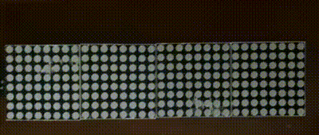

# MatrixLed
Library for the MAX7219 matrix LED module connected to an Arduino board.

## Installation
Create a folder named MatrixLed in your Arduino libraries location and copy this repo into that folder.

## Features
* Set column/row of each display.
* Control display settings and speed.
* Rendering sprites.
* Text scrolling.
* User defined fonts and custom character.
* User defined animation frames. 
